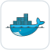

<h1 align="center">Ahmed Aman</h1>

  <strong>Support Engineer at Microsoft | Certified Kubernetes Administrator</strong>

  From troubleshooting complex systems to building reliable cloud delivery workflows

  

  
  &nbsp;&nbsp;&nbsp;&nbsp;
  
  &nbsp;&nbsp;&nbsp;&nbsp;
  <a href="Ahmed_Aman_CV.pdf" title="View Ahmed Aman's CV (PDF)">&nbsp;<strong>CV (PDF)</strong></a>

I'm based in **Cairo, Egypt**, with **6+ years of Windows and Microsoft 365 support experience** across Microsoft and Concentrix. My background is in performance troubleshooting, debugging, and technical escalations. I bring that diagnostic approach to hands-on **DevOps and cloud engineering** projects: building infrastructure, testing changes, and turning failures into repeatable safeguards.

**Open to DevOps and cloud engineering opportunities, especially remote roles that allow me to work from Egypt.**

## Featured project: [HomeOffice Commerce](https://github.com/aman-ahmed0/homeoffice-commerce)

**Completed portfolio implementation | Azure Kubernetes Service, Terraform and GitOps**

A three-tier application (**Next.js, Flask and PostgreSQL**) deployed to **Azure Kubernetes Service (AKS)**. The project connects infrastructure provisioning, container builds, security checks and reviewed Kubernetes deployments.

| Engineering area | What the project demonstrates |
| --- | --- |
| Infrastructure as code | Terraform provisions AKS, Azure Container Registry, the CI identity and role assignments. |
| CI and quality gates | GitHub Actions checks Terraform and Helm, builds both images, runs start-up smoke tests, and scans secrets and vulnerabilities with Trivy. |
| Cloud identity | CI authenticates to Azure with OIDC rather than a stored cloud password. Images are published to ACR with commit-SHA tags. |
| GitOps delivery | Helm defines the deployment; Argo CD tracks `main`. Image changes go through a pull request, followed by a reviewed, manual sync. |
| Kubernetes operations | Backend startup, readiness and liveness probes, resource limits, and a PostgreSQL StatefulSet with persistent Azure storage. |
| Container hardening | Non-root containers, a distroless frontend runtime, pinned base images and pinned backend dependencies. |

### Troubleshooting translated into engineering

A backend deployment failed to start after a dependency change. The project now pins dependencies, selects the database driver explicitly, and runs a smoke test against a temporary PostgreSQL container before publishing. The incident and the OIDC sign-in issue are documented alongside the implementation.

**[Architecture and walkthrough](https://github.com/aman-ahmed0/homeoffice-commerce#homeoffice-commerce)** · [CI workflow](https://github.com/aman-ahmed0/homeoffice-commerce/blob/main/.github/workflows/ci.yml) · [Terraform](https://github.com/aman-ahmed0/homeoffice-commerce/tree/main/infrastructure) · [Helm chart](https://github.com/aman-ahmed0/homeoffice-commerce/tree/main/charts/homeoffice-commerce) · [Incident lessons](https://github.com/aman-ahmed0/homeoffice-commerce#lessons-from-real-incidents)

*This is a portfolio project, not a production service. The cluster is stopped between work sessions to control cost. Monitoring, TLS and automated database backups remain [documented next steps](https://github.com/aman-ahmed0/homeoffice-commerce#known-limitations-and-next-steps).*

## Earlier project: [Python Web App](https://github.com/aman-ahmed0/webAppPy)

A focused Flask project with a Docker image build-and-publish workflow and Terraform definitions for **AWS EC2**. It demonstrates container packaging and infrastructure provisioning, rather than a complete automated application deployment.

[Workflow](https://github.com/aman-ahmed0/webAppPy/blob/73480cf74d78d7a51f6229cce78f5467f81d67d5/.github/workflows/deploy.yml) · [EC2 definition](https://github.com/aman-ahmed0/webAppPy/blob/73480cf74d78d7a51f6229cce78f5467f81d67d5/main.tf)

## Technical toolkit

  &nbsp;
  &nbsp;
  &nbsp;
  &nbsp;
  &nbsp;
  

| Context | Tools and technologies |
| --- | --- |
| Azure delivery project | AKS, ACR, Terraform, Docker, Helm, GitHub Actions, Argo CD, Trivy, OIDC, PostgreSQL |
| Earlier AWS project | EC2, Terraform, Docker, GitHub Actions, Flask |
| Scripting and broader training | Python, Bash, Ansible, Jenkins |
| Professional troubleshooting | Windows architecture, memory management, performance and shell issues, debugging, Sysinternals |

Project and training experience are distinct from my professional support background.

## Professional foundation

**Microsoft / Support Engineer**  
December 2021 to present

Windows performance and shell troubleshooting, debugging, and technical escalations. Investigating potential product defects and communicating findings for resolution.

**Concentrix / Windows and Office Support Engineer**  
December 2019 to December 2021

Windows and Microsoft 365 support for German-speaking customers.

**Languages:** German and English, fluent. Arabic, native.

## Credentials and learning

**[Certified Kubernetes Administrator](https://www.credly.com/badges/ef716503-154e-4014-a548-32d51cb12ca3/public_url)** · The Linux Foundation · September 2026  
**[Azure Fundamentals](https://www.credly.com/badges/e10f9a4d-686b-40e6-9d73-f9471150ed21)** · Microsoft · January 2022

**Completed training:** DevOps Bootcamp, TechWorld with Nana, December 2024.

**Previously earned:** Azure Administrator Associate (AZ-104), March 2022. Not currently active.

---

**Career focus:** DevOps and cloud engineering, with an interest in platform engineering and reliability.

[LinkedIn](https://linkedin.com/in/ahmedaman1/) · [ahmedaman7@outlook.com](mailto:ahmedaman7@outlook.com) · [CV (PDF)](Ahmed_Aman_CV.pdf)
