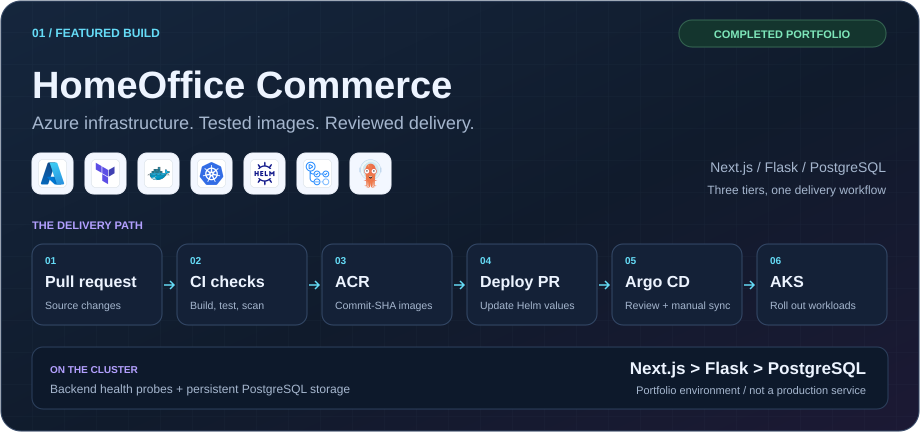

<h1 align="center">Ahmed Aman</h1>

  <strong>DevOps/Cloud Engineer | Certified Kubernetes Administrator</strong>

  From troubleshooting complex systems to building reliable cloud delivery workflows

  

  
  &nbsp;&nbsp;&nbsp;&nbsp;
  
  &nbsp;&nbsp;&nbsp;&nbsp;
  <a href="Ahmed_Aman_CV.pdf" title="View Ahmed Aman's CV (PDF)">&nbsp;<strong>CV (PDF)</strong></a>

## My Skills

###  Cloud Providers

  
  &nbsp;&nbsp;&nbsp;
  

###  CI/CD &amp; GitOps

  
  &nbsp;&nbsp;&nbsp;
  
  &nbsp;&nbsp;&nbsp;
  

###  Infrastructure as Code &amp; Automation

  
  &nbsp;&nbsp;&nbsp;
  

###  Containerization

  

###  Container Orchestration

  
  &nbsp;&nbsp;&nbsp;
  

###  Programming / Scripting

  
  &nbsp;&nbsp;&nbsp;
  

###  Databases

  

Skills developed through hands-on projects and training. Professional experience and credentials are detailed in my CV.

## Projects

<a href="https://github.com/aman-ahmed0/homeoffice-commerce">
  <picture>
    <source media="(max-width: 600px)" srcset="assets/project-homeoffice-mobile.svg">
    
  </picture>
</a>

**[HomeOffice Commerce](https://github.com/aman-ahmed0/homeoffice-commerce)** brings together **AKS, Terraform, Helm, GitHub Actions and Argo CD** in a deployed three-tier portfolio application.

- **Build safely:** start-up smoke tests, Trivy scans and passwordless Azure sign-in with OIDC.
- **Deploy deliberately:** commit-SHA image tags, reviewed deployment changes and backend health probes.
- **Learn from failures:** a backend crash led to pinned dependencies and a regression smoke test.

[Explore project](https://github.com/aman-ahmed0/homeoffice-commerce) · [CI workflow](https://github.com/aman-ahmed0/homeoffice-commerce/blob/main/.github/workflows/ci.yml) · [Incident lessons](https://github.com/aman-ahmed0/homeoffice-commerce#lessons-from-real-incidents)

Portfolio, not a production service. The cluster is stopped between sessions. Monitoring, TLS and automated backups are <a href="https://github.com/aman-ahmed0/homeoffice-commerce#known-limitations-and-next-steps">documented next steps</a>.

### Earlier project

**[Python Web App](https://github.com/aman-ahmed0/webAppPy)** is my earlier container-packaging and AWS provisioning project, not a complete automated deployment.

---

  <strong>Open to DevOps &amp; Cloud Engineering opportunities</strong> 
  Especially remote roles from Egypt or abroad.

  <a href="https://linkedin.com/in/ahmedaman1/">LinkedIn</a> &nbsp;&bull;&nbsp;
  <a href="mailto:ahmedaman7@outlook.com">Email</a> &nbsp;&bull;&nbsp;
  <a href="Ahmed_Aman_CV.pdf">CV (PDF)</a>

